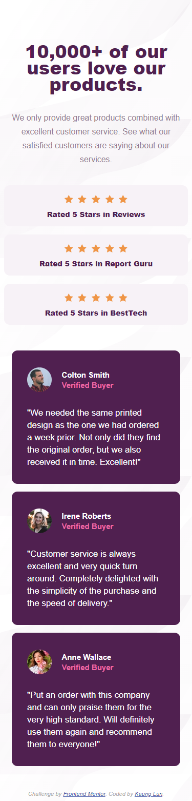

# Frontend Mentor - Social proof section solution

This is a solution to the [Social proof section challenge on Frontend Mentor](https://www.frontendmentor.io/challenges/social-proof-section-6e0qTv_bA). Frontend Mentor challenges help you improve your coding skills by building realistic projects.

## Table of contents

- [Overview](#overview)
  - [The challenge](#the-challenge)
  - [Screenshot](#screenshot)
  - [Links](#links)
- [My process](#my-process)
  - [Built with](#built-with)
  - [What I learned](#what-i-learned)
  - [Continued development](#continued-development)
- [Author](#author)

## Overview

### The challenge

Users should be able to:

- View the optimal layout for the section depending on their device's screen size

### Screenshot

### Links

- Solution URL: solution URL (https://github.com/lunk-kml/social-proof.git)
- Live Site URL: live site URL (https://lunk-kml.github.io/social-proof/)

## My process

I coded the mobile version first and then work all the way up to the desktop version. I also worked on the laptop version when I don't have to but I did it anyways because it just doesn't look right.

### Built with

- VS Code Editor
- Google Chrome (Inspect Mode)

### What I learned

- (Desktop Version) Getting the bottom purple buyers card to display next to each other and not to appear in a straight line.
  - Maybe there's a better and easy way to code that. I'll find that one day.
- (Desktop Version) My difficulties was getting the text appear next to the stars and making it different from the mobile version.

### Continued development

- Must learn to make text, image, or any elements appear next to each other without any difficulties. - inline or inline-block
- Really need to learn to center everything in the body element. - Maybe its the problem with the margin. NOT Sure.

## Author

- Website - [LunK-KML](https://github.com/lunk-kml)
- Frontend Mentor - [@lunk-kml](https://www.frontendmentor.io/profile/lunk-kml)
